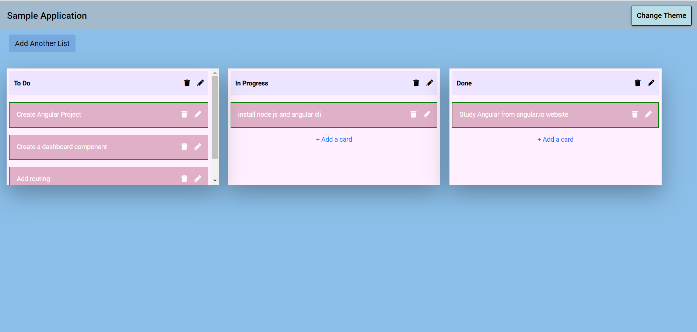

# Demo Task


# _About the App_
This application showcases my Angular experience by building the problem statment provided!

The first phase will focus on creating the view of a new board, including lists with cards.

Below is a screenshot of the project after phase one:


# _Specifications_

### Necessary Features & Functionality
| Feature | Description | Notes |
|--|--|--|
| New board | Main view: Display as if a user had created a new, empty board | Default colors. Could possibly include a pre-built board for demo purposes |
| New list | Create new list when user clicks button | Ask for the list name before creating |
| Add card | Asks user to enter a title for the card | 'Add card' button pushes card to list |

### Secondary Features & Functionality
| Feature | Description 
|--|--|--|
| Dragging items | Users to drag cards

### Component Tree
```
trello-clone  
└───src
│   └───app [will contain main board]
│       │   app.component.css
│       │   app.component.html
│       │   app.component.spec.ts
│       │   app.module.ts
│       └───board
|              │   board.component.css
│              │   board.component.html
│              │   board.component.spec.ts
│              │   board.component.ts
│       └───list
|              │   list.component.css
│              │   list.component.html
│              │   list.component.spec.ts
│              │   list.component.ts
│       └───card
|              │   card.component.css
│              │   card.component.html
│              │   card.component.spec.ts
│              │   card.component.ts
```

# _Installation for OSX_
- Download the repository from GitHub (https://github.com/PRAJYOT25/angular-TrelloCards)
- Install Node.js on your machine
- `npm install` to install all necessary packages
- `ng serve --open` to run the application in your browser
